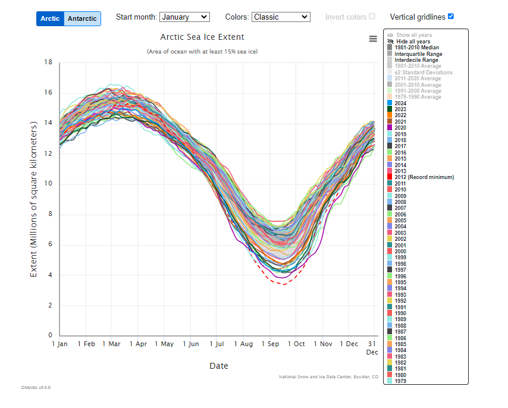

# The Silent Sentinels: How NASA's Data Unveils the Hidden Story of Climate Change

## Introduction

In the vast expanse of space, satellites orbit our planet like silent sentinels, collecting invaluable data that tells the story of Earth's changing climate. Over the past several decades, an enormous amount of climate data has been amassed, much of it freely available to the public. However, navigating this ocean of information can be daunting. This article delves into open-source climate data from the U.S. Greenhouse Gas Center to weave a compelling narrative about climate change. We will explore significant trends, understand the importance of the data, and discuss potential solutions, all while highlighting NASA's crucial role in providing this information.

## The Rising Tide of Greenhouse Gases

One of the most pressing indicators of climate change is the steady increase in greenhouse gas concentrations in Earth's atmosphere. Greenhouse gases, such as carbon dioxide (CO₂), methane (CH₄), and nitrous oxide (N₂O), trap heat and contribute to global warming. According to data from the U.S. Greenhouse Gas Center, CO₂ levels have risen from pre-industrial levels of approximately 280 parts per million (ppm) to over 415 ppm in recent years (U.S. Greenhouse Gas Center).

### Why This Data Matters

The significance of this data lies in its direct correlation with global temperature rise. Higher concentrations of greenhouse gases amplify the greenhouse effect, leading to warmer global temperatures. This warming triggers a cascade of environmental impacts, including melting polar ice, rising sea levels, and more frequent extreme weather events. Understanding the concentration levels of these gases is crucial for predicting future climate scenarios and formulating mitigation strategies.

### NASA's Role in Monitoring Greenhouse Gases

NASA plays a pivotal role in monitoring Earth's climate. Through missions like the Orbiting Carbon Observatory-2 (OCO-2), NASA provides precise measurements of CO₂ levels in the atmosphere. These satellites offer a global perspective, capturing data that ground-based sensors might miss. The information collected helps scientists validate climate models and enhances our understanding of carbon sources and sinks (NASA, "Orbiting Carbon Observatory-2").

## The Melting Ice Caps: A Harbinger of Change

Another stark indicator of climate change is the accelerated melting of polar ice caps and glaciers. Satellite data reveals that Arctic sea ice is declining at a rate of 13% per decade, relative to the 1981 to 2010 average (U.S. Greenhouse Gas Center). The loss of ice not only contributes to rising sea levels but also reduces the Earth's albedo effect, where less sunlight is reflected back into space, further exacerbating global warming.

### Data Visualization: Arctic Sea Ice Decline

*Figure 1: Decline in Arctic Sea Ice Extent from 1980 to 2024 (U.S. Greenhouse Gas Center).*

### The Importance of This Data

The data on ice melt is critical for coastal communities and ecosystems worldwide. Rising sea levels threaten to inundate low-lying areas, displacing millions of people and causing significant economic losses. Additionally, the loss of ice habitats endangers species like polar bears and seals, disrupting the ecological balance. By monitoring these changes, we can better predict future trends and develop adaptation strategies.

### NASA's Earth Observing System

NASA's Earth Observing System (EOS) consists of a series of satellites designed to monitor Earth's climate and environmental systems. Instruments like the Moderate Resolution Imaging Spectroradiometer (MODIS) on the Terra and Aqua satellites provide comprehensive data on sea ice coverage, land surface temperature, and cloud properties. This information is vital for tracking the progression of climate change and validating predictive models (NASA, "Earth Observing System").

## Extreme Weather Events on the Rise

Climate change is also linked to an increase in the frequency and intensity of extreme weather events. Data indicates a significant uptick in heatwaves, hurricanes, and wildfires over the past few decades. For instance, the number of record high-temperature events in the United States has been increasing, while record low-temperature events have been decreasing since the 1950s (U.S. Greenhouse Gas Center).

### Understanding the Data

The rise in extreme weather events is a direct consequence of higher global temperatures. Warmer oceans fuel more intense hurricanes, while prolonged heat contributes to droughts and wildfires. By analyzing this data, scientists can identify patterns and improve forecasting, which is essential for disaster preparedness and response.

### NASA's Contribution to Weather Monitoring

NASA's Global Precipitation Measurement (GPM) mission provides advanced observations of rain and snow worldwide. These measurements help improve our understanding of Earth's water and energy cycles, which are crucial for predicting extreme weather events. The data collected supports weather forecasting and climate modeling, aiding in the protection of life and property (NASA, "Global Precipitation Measurement").

## Potential Solutions and Actions

While the data paints a concerning picture, it also guides us toward potential solutions. Reducing greenhouse gas emissions is paramount. This can be achieved through a combination of renewable energy adoption, energy efficiency improvements, and carbon capture technologies. Additionally, reforestation and conservation efforts can enhance natural carbon sinks.

### The Role of Individuals and Communities

Individuals can contribute by adopting sustainable practices such as reducing energy consumption, using public transportation, and supporting environmentally friendly policies. Community-level actions, like implementing local renewable energy projects and promoting sustainable agriculture, can also make a significant impact.

### Need for Further Study

These suggestions are initial steps that require further research and validation. Implementing effective solutions necessitates a comprehensive understanding of the complex interactions within Earth's climate system. Continued data collection and analysis are essential for refining these strategies.

## Conclusion

Climate change is one of the most significant challenges facing humanity. The wealth of data collected by organizations like the U.S. Greenhouse Gas Center and NASA provides invaluable insights into the state of our planet. By harnessing this information, we can tell compelling stories that not only inform but also inspire action. NASA's commitment to monitoring Earth's climate equips us with the knowledge needed to address the challenges ahead. As we stand at a crossroads, the silent sentinels orbiting above remind us that while the data may be vast, so too is our capacity for innovation and change.

## Works Cited

- NASA. "Earth Observing System." *NASA Science Mission Directorate*, 2021, [https://eospso.nasa.gov/mission-category/earth-observing-system-eos](https://eospso.nasa.gov/mission-category/earth-observing-system-eos).

- NASA. "Global Precipitation Measurement." *NASA*, 2021, [https://www.nasa.gov/mission_pages/GPM/main/index.html](https://www.nasa.gov/mission_pages/GPM/main/index.html).

- NASA. "Orbiting Carbon Observatory-2." *NASA Jet Propulsion Laboratory*, 2021, [https://ocov2.jpl.nasa.gov/](https://ocov2.jpl.nasa.gov/).

- U.S. Greenhouse Gas Center. *Data Catalog*, [https://earth.gov/ghgcenter/data-catalog](https://earth.gov/ghgcenter/data-catalog).

- National Snow and Ice Data Center. "Arctic Sea Ice Extent Graph." NSIDC Arctic Sea Ice News & Analysis, 2023, [https://nsidc.org/arcticseaicenews/charctic-interactive-sea-ice-graph/](https://nsidc.org/arcticseaicenews/charctic-interactive-sea-ice-graph/).
